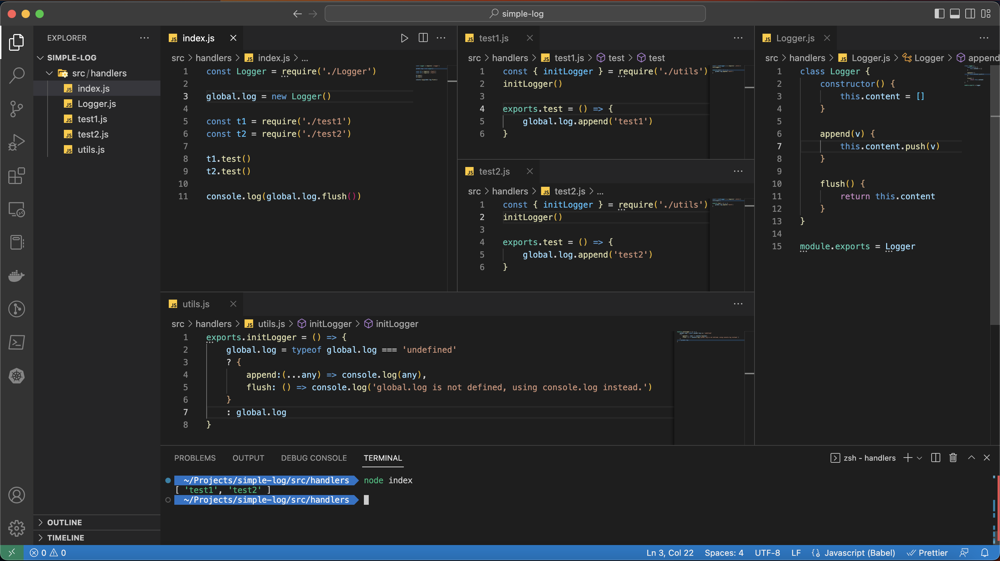
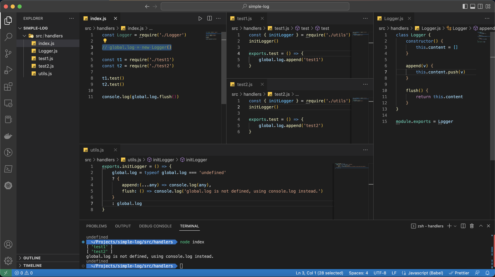

# template-global-log

This feature supports logging on AWS Lambda to `S3`. Please modify `Logger.flush()` to write your log content into file then upload to `S3`.



## Usage

Firstly, please modify `Logger` class based on your objective of logging then import to main script, in this case is `src/handlers/index.js`.

After imported it, set to global variable :

```js
const Logger = require('./Logger')
global.log = new Logger()

// You code here
```

In other modules/function or script, ex. `test1.js` just call `global.log.append(YOUR_OBJECT_FOR_LOGGING)` :

```js
exports.test = () => {
    global.log.append('test1')
}
```

To prevent any unexpected on logging, please check `undefined` first :

```js
global.log = typeof global.log === 'undefined'
? { 
    append:(...any) => console.log(any), 
    flush: () => console.log('global.log is not defined, using console.log instead.') 
}
: global.log
```

or just initial logger first :

```js
const { initLogger } = require('./utils')
initLogger()

exports.test = () => {
    global.log.append('test1')
}
```

example :

